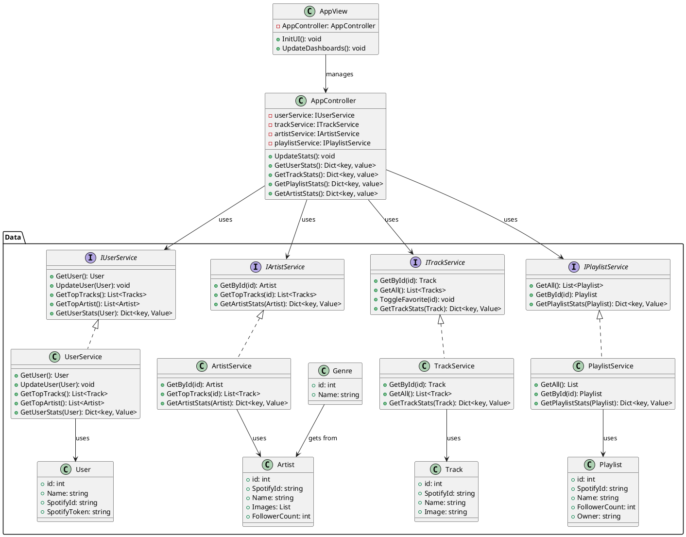

#pos 

In unsere App sollte man seine eigenen Spotify Statistiken anschauen können. Dafür werden, falls vorhanden, die Daten aus unserer eigenen DB geladen. 

Diese Daten werden immer erneuert, wenn man die App startet - insofern es neue Daten gibt. Auch kann man diese Daten per Click auf unserem Refreshbutton aktualisieren. 

So kann man dann nach längerer Benutzung die Statistiken anschauen wie:
- Anzahl angehörter Minuten
- Meist angehörte/r...
    - Artist
    - Track
    - Playlists

In unserem Mainwindow sieht man eine grobe Übersicht über ein paar spannende Daten. Über unsere Nav-Bar kann man genauere Daten anschauen wie meist gehörte Artists, Tracks, etc...

## Must-Haves

- Dashboard mit Grunddaten
- Statistiken
- Verschieden Tabs
- Data Crunching! -> Wie speichere ich Daten und was kann ich herauslesen!
- Userhandling - DB abspeichern

## Nice-To-Haves

- Userhandling - Mit Spotify-Account 
- Über unsere App direkt in Spotify auf die Lieder zugreifen
- Informationen über Künstler, Songs, etc... als Unterfenster 
- Automatisches Refreschen der Daten
- Filter für Stats

## GUI Scribbles 

![[POS-Projektbeschreibung-1.png]]

## Arbeitsteilung POS Teil
 
| Wer     | Was                                    | Dauer      |
| ------- | -------------------------------------- | ---------- |
| Jonas   | Track, Genre, Playlist Klassen         | 1 Tag      |
| Dominik | Artist,User,AppController Klassen      | 1 Tag      |
| Jonas   | API Services                           | 1-2 Wochen |
| Dominik | GUI Layer (Appview)                    | 2-3 Wochen |
| Jonas   | Verbindung Data Layer mit Domain Layer | 1 Woche    |
| Dominik | Verbindung Domain Layer mit GUI Layer  | 1 Woche    |

## Klassendiagramm

> [!Important] Wichtig
> - **Artist:** *GetPlayCount()* muss über unsere *DB* abfragen
> - **Genre:** Genres sind in der API nicht perfekt vorhanden. Sie können über den *Artist* gekriegt werden.
> - **Track:** *GetDurationMin()* gibt die *Dauer* des Liedes in *Minuten* zurück
> - **Playlist:** *Owner* könnte auch *User* sein

## Main seite
- Listview 5 letzte Songs
- Top 5 Artists
- Letzte Tage wie viel Minutes listened