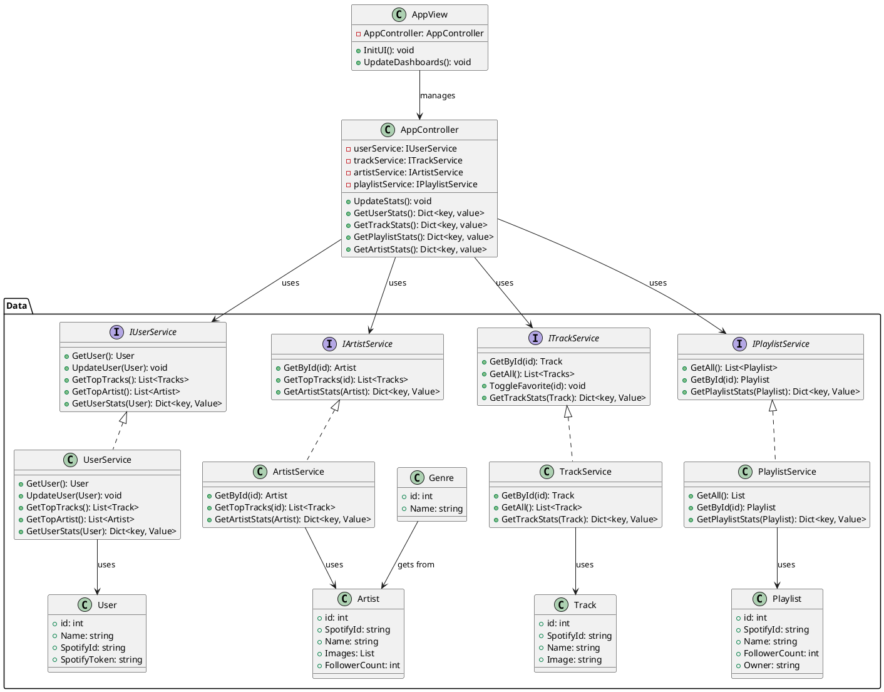
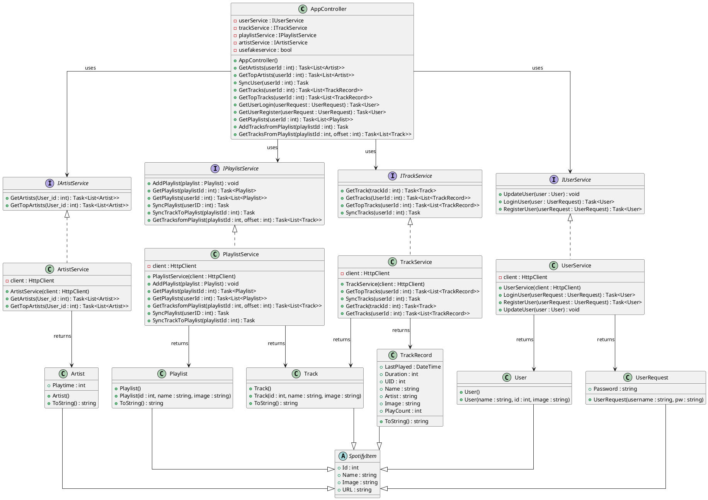

#pos 
# Statify Dokumentation - POS
## Team
**Dominik Nageler** & **Jonas Marte**
## Betreuer
**Lukas Diem** & **Christoph Bauer**

```table-of-contents
```

---

<div style="page-break-after: always;"></div>


# 1. Planung (Lastenheft)

![[POS-Projektbeschreibung]]

## GUI-Konzept

### Fensterübersicht

1. Login-Window: Sich mit **Benutzernamen** und **Passwort** anmelden. Ist wichtig für unsere eigene DB und unser Userhandling.
2. Register-Window: Sich mit **Benutzernamen** und **Passwort** registrieren.
3. Main-Window: Hier wird das Handling von unseren **Pages** gemacht. Dafür ist hier ein großer **Frame** hier drauf und oben eine **TabControl**.

### Navigation

Bevor die App voll gestartet ist, öffnet sich im **Browser** ein Fenster wo man sich mit seinem **Spotify Account verknüpfen** muss. Danach kann man sich dann **einloggen** oder **registrieren** bei unserer App.

Nachdem man sich eingeloggt/registriert hat landet man auf der **Main Page**. Hier sieht man - sobald es geladen ist - dann ein paar **wichtige Stats**. Oben links kann man dan per **Mouse-Click** auf die **Tabs** switchen (**Artists, Tracks oder Playlists**). Dann öffnet sich die **korrespondierende Page** mit **genäueren Stats** zu dem **ausgewähltem Punkt**. 

Auf der **Playlistpage** kann man per **Click** auf eine **Playlist** dann die **Songs** von dieser **Playlist holen** - welche dann auch danach angezeigt werden.

<div style="page-break-after: always;"></div>


## UML-Klassendiagramm
### Geplant


<div style="page-break-after: always;"></div>

### Umsetzung




---

<div style="page-break-after: always;"></div>

# 2. Umsetzung

## Verwendete Technologien

| Technologie / Paket              | Version         |
| -------------------------------- | --------------- |
| .NET                             | 10.0            |
| WPF                              | net10.0-windows |
| coverlet.collector               | 6.0.4           |
| Microsoft.NET.Test.Sdk           | 17.14.1         |
| xunit.runner.visualstudio        | 3.1.4           |
| LiveChartsCore.SkiaSharpView.WPF | 2.0.4           |
| Serilog                          | 4.3.1           |
| Serilog.Sinks.Console            | 6.1.1           |
| Serilog.Sinks.File               | 7.0.0           |
| Uno.UI                           | 5.6.99          |
| xunit                            | 2.9.3           |
## Projektstruktur

Der **AppController** managed unsere ganze App so ziemlich. Er ruft dann immer in den **jeweiligen Services** die **Methode** auf die gebraucht wird um das gewollte zu **GET, POST, PUT oder DELETE**. Dafür hat **jede Page** immer einen **AppController** über den sie dann die Funktionen aufrufen kann.

Zwischen den Pages kann man wechseln indem man über unsere **TabControl** auf dem **MainWindow** wechselt, welche **Page** in unserem **MainFrame** angezeigt wird.

---
# 3. Vergleich Planung vs Umsetzung

| Geplant      | Ergebnis        | Bemerkung                                                                                |
| ------------ | --------------- | ---------------------------------------------------------------------------------------- |
| Stats Filter | Nicht gemacht   | Zeitmangel & wenig Nutzen                                                                |
| Genre        | Nicht vorhanden | Spotify API unterstütz es nicht mehr                                                     |
| AppView      | Nicht vorhanden | Jede Page hat einen AppController und managed sich selbst od Mainwindow managed den Rest |

---
# 4. KI-Unterstützung

## Verwendete Tools

- ChatGPT
- GitHub Copilot
- Claude Code
- Claude

## Beispiele

### Prompt

```text
How can i fix the playtime in my artists diagram?
```

### Ergebnis

Als Ergebnis habe ich dann die **MsToMinutesConverter** Klasse gekriegt. Diese konnte ich danach dann immer bei **Bindings** leicht reinschreiben.

---

# 5. Projekttagebuch

| Datum      | Person  | Tätigkeit                                                             |
| ---------- | ------- | --------------------------------------------------------------------- |
| 21.05.2026 | Dominik | Repository, AppController/AppView, erste Fake Services                |
| 21.05.2026 | Jonas   | Projektinitialisierung, Basisklassen, Fake Services                   |
| 22.05.2026 | Jonas   | Projektstruktur angepasst, Library umgestellt                         |
| 24.05.2026 | Dominik | Track FakeService implementiert                                       |
| 25.05.2026 | Dominik | Dashboard-Paket, TabHandling, Pages                                   |
| 26.05.2026 | Jonas   | Fake Services, Artist Page, PieChart                                  |
| 27.05.2026 | Dominik | Login/Register-Fenster, User-Login                                    |
| 27.05.2026 | Jonas   | SpotifyItem-Modell bereinigt                                          |
| 28.05.2026 | Dominik | User Login/Register, TrackService                                     |
| 28.05.2026 | Jonas   | TrackPage, UserService, Track Model Refactoring                       |
| 30.05.2026 | Jonas   | Track-Sync, TrackRecord, UI-/Model-Anpassungen                        |
| 31.05.2026 | Dominik | ArtistService, Bilderanzeige                                          |
| 31.05.2026 | Jonas   | Playlist Page, Playlist-Fake-Daten                                    |
| 01.06.2026 | Dominik | SpotifyItemView, SpotifyViewModel                                     |
| 01.06.2026 | Jonas   | TrackPage, Chart-Anpassungen, TODOs bereinigt                         |
| 02.06.2026 | Dominik | TrackDetailPage                                                       |
| 02.06.2026 | Jonas   | TrackPage GridView, Quality-of-Life-Anpassungen                       |
| 03.06.2026 | Dominik | Authorization, UI-Anpassungen, Fullscreen                             |
| 03.06.2026 | Jonas   | TrackPage aktualisiert                                                |
| 08.06.2026 | Dominik | PlaylistService                                                       |
| 08.06.2026 | Jonas   | Zwischenstand                                                         |
| 10.06.2026 | Dominik | ArtistDetailPage, PlaylistView, Artist/PlaylistService                |
| 10.06.2026 | Jonas   | Playtime Artist, FakeServices-Fixes                                   |
| 11.06.2026 | Dominik | Spotify-Button, URL, Artist FakeService                               |
| 11.06.2026 | Jonas   | AI-Design-Refactoring, PlaylistPage, TrackPage PieChart               |
| 13.06.2026 | Dominik | PlaylistDetailPage, SpotifyItemView UI, API-Call-Optimierung          |
| 13.06.2026 | Jonas   | Loading Screen, Login/Register Redesign, Duration Converter, Bugfixes |
| 14.06.2026 | Jonas   | TrackPage-Bilder, Scroll-Funktion, BarChart, TODOs entfernt           |
| 15.06.2026 | Dominik | Letzte Änderungen, Merge, Zwischenstand                               |

<div style="page-break-after: always;"></div>

# 6. Reflexion

## Was lief gut?
- Arbeitsmoral
- Zeitplan
- Spotify-Account Verknüpfen
- Ohne AI Teil ging viel besser wie erwartet

## Was lief schlecht?
- 24h Ban bei zu vielen Requests
- DB-Planung

## Wo war KI hilfreich?
- UI Design
- Fehler finden
- Livecharts Nugget Package lernen

## Was würden wir anders machen?
- Aufgabenverteilung bei der Planung mit mehr Mühe und bedacht machen
- Mehr Funktionalität 
	- Adden
	- Spotify Player kleiner

---

# 7. Quellen

## Bilder / Medien

| Quelle                                          | Lizenz                                                     |
| ----------------------------------------------- | ---------------------------------------------------------- |
| https://www.flaticon.com/free-icon/user_1144760 | Free for personal and commercial purpose with attribution. |

---

# 8. Repository

GitHub-Link: https://github.com/Cookie0077/Statify_POS